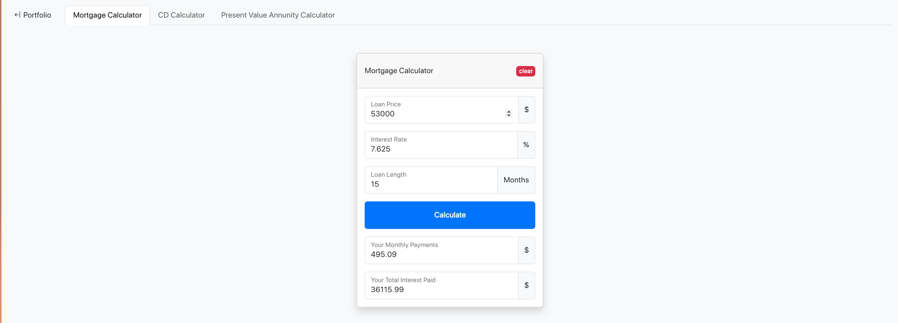
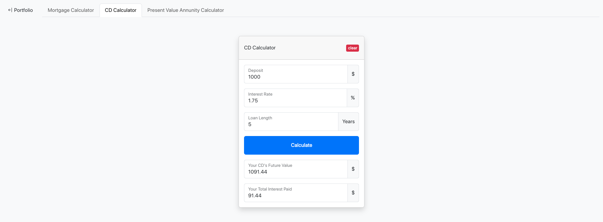
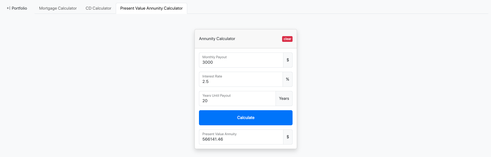
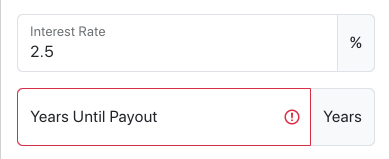

# Financial Calculators

*Responsive website housing multiple financial calculators built with **Javascript** **HTML** **Bootstrap** and **CSS***

> Mortgage Calculator [https://joncgroberg.github.io/FinancialCalculators/mortgageCalculator.html](https://joncgroberg.github.io/FinancialCalculators/mortgageCalculator.html)

> CD Calculator [https://joncgroberg.github.io/FinancialCalculators/mortgageCalculator.html](https://joncgroberg.github.io/FinancialCalculators/cdCalculator.html)

> Annuity Calculator [https://joncgroberg.github.io/FinancialCalculators/presentValueAnnuityCalculator.html](https://joncgroberg.github.io/FinancialCalculators/presentValueAnnuityCalculator.html)

### Calculators

1. Mortgage Calculator
   

   - Inputs of **principal**, **interest** rate, and **loan length** entered by the user
   - Outputs the **expected monthly payment** and **total interest** paid

1. Future Value Calculator
   

   - Inputs of **deposit**, **interest** rate, and **number of years** from the user
   - Outputs the **future value** and the **total interest** earned

1. Present Value Ordinary Annuity Calculator.
   

   - Inputs of **monthly payout**, **expected interest rate**, and years to pay out from
     the user
   - Outputs the **present value** of that annuity

## Features

### User Experience

- Consistent navigation and theme
- **Focus** automatically on the first input field
- Monetary values rounded to **2 decimal** point values and include **$** where needed
- Abilty to clear input using a `reset` button
- Calculation animation
- Inability to enter bad data using **input restriction**

  

  #### Notable Feature: Calculation **Animation**

  ```javascript
  function animateSending() {
    calculateBtn.classList.toggle("sending");
    calculateBtn.innerText = "Calculate";
    setTimeout(function () {
      calculateBtn.classList.toggle("sending");
      calculateBtn.innerText = "Calculate";
    }, 300);
  }
  ```

  


### Technical

- Uses `readonly` on output form fields
- Appropriate **branch** structure and **commit** history
  
- Screen shots
  - **Each** calculator page that shows inputs and correct outputs
  - Erroneous inputs and an error message.
- Documentation of **notable** pieces of code.


